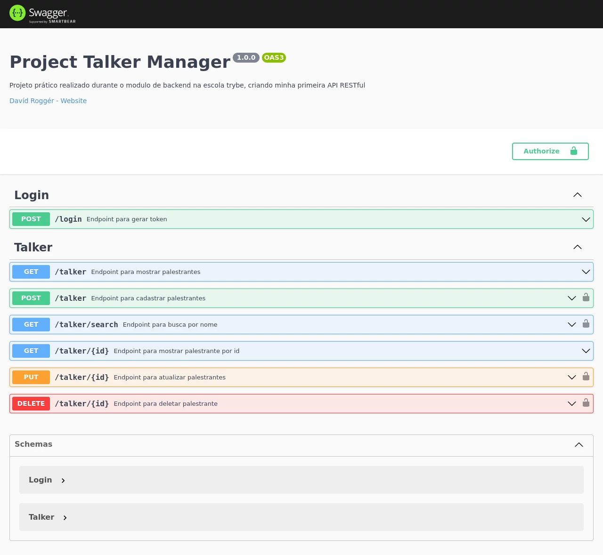
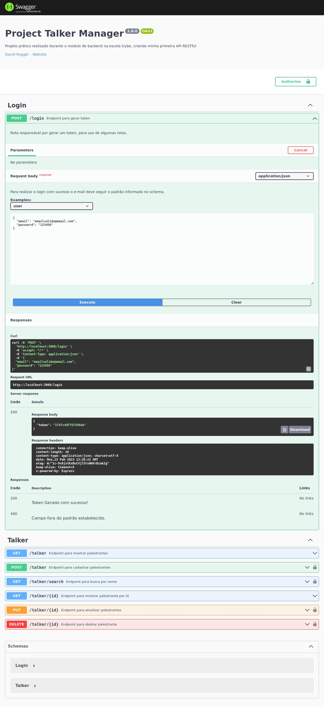
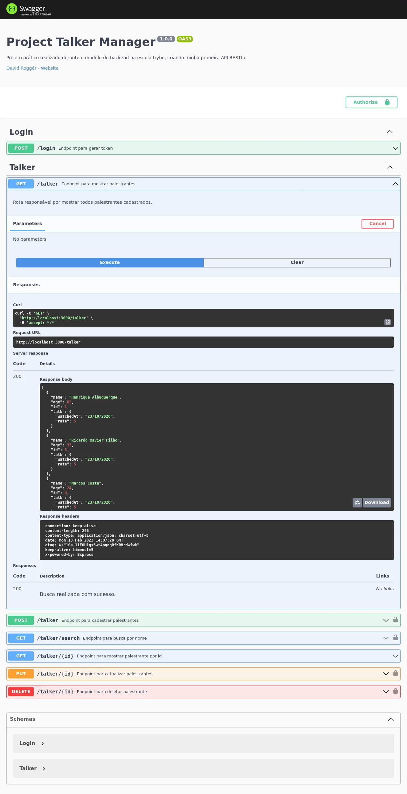

# Sobre

## Seção: `Introdução ao desenvolvimento Web com Node.js`

- Foi apresentada o uso do Node.js detalhando mais o uso do npm, que ja era usado, ensinando a criar e usar scripts com ele.
- Seguindo de uma introdução ao que é uma API, com detalhes sobre a arquitetura RESTful, aprensentando suas cinco principais caracteristicas, Uniform Interface, client-server, stateless, cacheable e layered system.
- Então foi apresentado um framework, o Express para desenvolvimento web de APIs, usando middlewares e rotas.

#
<div align="center">
  <a href="https://raw.githubusercontent.com/davidrogger/trybe-project-talker-manager/readme-update/readme-imgs/project_top.webp">
    
  </a>
  <a href="https://raw.githubusercontent.com/davidrogger/trybe-project-talker-manager/readme-update/readme-imgs/project_mid.webp">
    
  </a>
  <a href="https://raw.githubusercontent.com/davidrogger/trybe-project-talker-manager/readme-update/readme-imgs/project_bot.webp">
    
  </a>
</div>

>*Imagens da documentação do swagger*
#
## Projeto: `Talker Manager`

- Uma API de palestrantes onde é possivel, cadastrar, listar, pesquisar, editar e excluir palestrantes.

# Tecnologias e ferramentas usadas 🛠


# Desafios

- Desenvolver uma API com node.js
- Estruturar a API usando as principais caracteristicas do RESTful
- Organização do código, usando middlewares e routers de forma limpa e organizada.

# Conclusão

- Uma API pequena, que estimulou aprendizados e organização com Express, reaproveitando middleware de forma a validar informações em diversas rotas diferentes sem repetir o código, tornando o código mais limpo e de fácil manutenção.

</details>

<details>
  <summary>
    <strong>
      :newspaper_roll: Requisitos solicitados durante o desenvolvimento do projeto
    </strong>
  </summary>

 
  ### Requisitos
  *Nome* | *Avaliação*
  --- | :---:
  1 - Crie o endpoint GET /talker | :heavy_check_mark:
  2 - Crie o endpoint GET /talker/:id | :heavy_check_mark:
  3 - Crie o endpoint POST /login | :heavy_check_mark:
  4 - Adicione as validações para o endpoint /login | :heavy_check_mark:
  5 - Crie o endpoint POST /talker | :heavy_check_mark:
  6 - Crie o endpoint PUT /talker/:id | :heavy_check_mark:
  7 - Crie o endpoint DELETE /talker/:id | :heavy_check_mark:
  8 - Crie o endpoint GET /talker/search?q=searchTerm | :heavy_check_mark:

</details>

<details>
  <summary>
    <strong>
      :memo: Todo list
    </strong>
  </summary>

  - [x] - ~~Criar aplicação com base nos requisitos da trybe.~~ 

</details>

<details>
  <summary>
    <strong>
      :computer: Instruções do  Projeto
    </strong>
  </summary>

> ### Importante seguir a ordem apresentada a baixo, para o funcionamento.

<details>
<summary>
  <strong>
    ⚠️ Configurações mínimas para execução do projeto
  </strong>
</summary>

  > - Sistema Operacional Distribuição Unix
  > - Node versão >= 16
  > - Docker
  > - Docker-compose versão >=1.29.2
  > - API Client ([Thunder Client](https://www.thunderclient.com/), [Insomnia](https://insomnia.rest/), [POSTMAN](https://www.postman.com/), ou algum outro de sua preferência)

  </details>

  <details>
  <summary>
    <strong>
      ⚠️ Inicie o docker-compose
    </strong>
  </summary>

  >Após clonar o respositório para iniciar o docker compose, você deve dentro da pasta raiz do projeto usar o comando: `docker-compose up -d`
  >Verifique se os container está funcionando usando o comando `docker ps` no terminal. Deve aparecer um container com o nome de *talker_manager*.
  </details>

  <details>
    <summary>
      <strong>
        🗂 Acessando as Rotas
      </strong>
    </summary>

  >Existem duas formas de acessar e testar as rotas:
  >1. Usando algum API Cliente, conforme citado nas configurações mínimas.
  >2. Acessando a documentação gerada pelo swagger `localhost:3000/api-docs`.

  <details>  
  <summary>
    <span>Endpoint <code>/login</code></span>
  </summary>

  ## POST - `localhost:3000/login`

  > - Rota responsável por gerar um token, para acesso de algumas rotas da API.
  > - Para gerar o token é necessário realizar uma requisição POST para URL: `localhost:3000/login` contendo um corpo json, com um e-mail e senha válidos.
  > - **`E-mail`** é considerado válido quando ele segue um padrão de uma string sem limites de caracteres seguindo de `@` com outra string sem limites, com um ponto `.`, e após o ponto uma string com limite de 4 caracteres. `string@string.4str`.
  > - **`Senha`** é considerada válida quando possuir mais ou igual a 6 caracteres.
  >
  > ### Exemplo:
  >```
  >{
  >  "email": "emailvalido@email.com",
  >  "password": "123456"
  >}
  >```
  > ### Status:
  > - **`200`**: Em caso de sucesso, retorna com um json com um token valido.
  > - **`400`**: Caso algum campo não esteja preenchido ou esteja fora do padrão.

  </details>

  <details>
  <summary>
      <span>Endpoint <code>/talker</code></span>
  </summary>

  ## GET - `localhost:3000/talker`

  >- Rota responsável por apresentar todos palestrantes cadastrados.
  > - **`200`**: Em caso de sucesso, retorna com um json todos palestrantes cadastrados.

  ## POST - `localhost:3000/talker`

  > - Rota responsável por cadastrar palestrantes.
  > - É necessário adicionar ao headers o token para executar esta requisição.
  > - Para cadastrar um palestrante, é necessário realizar uma requisição com um corpo json contendo os seguindos dados.
  > - **`name`**: Nome deve conter no mínimo 3 caracteres.
  > - **`age`**: Idade deve ser um número maior que 18, pois os palestrantes devem ser maiores de 18 anos.
  > - **`talk`**: Deve ser um objecto contento seguintes chaves:
  >     - **`watchedAt`**: Deve conter a data da apresentação seguindo uma formatação `dd/mm/aaaa`
  >     - **`rate`**: Deve ser uma nota entre 1 e 5.
  > ### Exemplo:
  >```
  >{
  >  "name": "Jonas Doe",
  >  "age": "30",
  >  "talk": {
  >   "watchedAt": "10/02/2023",
  >   "rate": "4"
  >  }
  >}
  >```
  > ### Status:
  > - **`201`**: Em caso de sucesso, com um json com os dados cadastrados contendo o id do palestrante.
  > - **`400`**: Caso algum campo não esteja preenchido ou esteja fora do padrão.
  > - **`401`**: Quando o acesso não é autorizado, faltando definir um token para acesso.

  ## GET - `localhost:3000/talker/search`

  > - Rota responsável por buscar palestrante por nome.
  > - É necessário adicionar ao headers o token para executar esta requisição.
  > - Para buscar um palestrante, é necessário realizar uma requisição usando o parametro q seguindo do nome que deseja localizar.
  > ### Exemplo:
  >```
  >localhost:3000/talker/search?q=Henrique
  >```
  > ### Status:
  > - **`200`**: Em caso de sucesso, retorna um json todos palestrantes que contém o nome usado no parametro. Caso seja passado um parametro vazio `?q=`, é retornado todos palestrantes cadastrados.
  > - **`401`**: Quando o acesso não é autorizado, faltando definir um token para acesso.

  ## GET - `localhost:3000/talker/:id`

  > - Rota responsável por buscar palestrante pelo ID.
  > - Para buscar um ID, é necessário realizar uma requisição usando o parametro apontando o ID que deseja localizar.
  > ### Exemplo:
  >```
  >localhost:3000/talker/1
  >```
  > ### Status:
  > - **`200`**: Em caso de sucesso, retorna com um json com os dados do ID indicado no parametro.
  > - **`404`**: Quando o ID não é encontrato.

  ## PUT - `localhost:3000/talker/:id`

  > - Rota responsável por atualizar dados do palestrante pelo ID.
  > - É necessário adicionar ao headers o token para executar esta requisição.
  > - Para atualizar, é necessário realizar uma requisição usando o parametro apontando o ID que deseja localizar com um corpo json com todos dados do palestrante seguindo o mesmo modelo json usado para cadastrar um novo palestrante.
  > ### Status:
  > - **`200`**: Em caso de sucesso, retorna com um json com os dados cadastrados atualizados do palestrante.
  > - **`400`**: Caso algum campo não esteja preenchido ou esteja fora do padrão.
  > - **`401`**: Quando o acesso não é autorizado, faltando definir um token para acesso.
    > - **`404`**: Quando o ID não é encontrato.

  ## DELETE - `localhost:3000/talker/:id`

  > - Rota responsável por deletar cadastro do palestrante pelo ID.
  > - É necessário adicionar ao headers o token para executar esta requisição.
  > - Para deletar, é necessário realizar uma requisição usando o parametro apontando o ID que deseja deletar.
  > ### Exemplo:
  >```
  >localhost:3000/talker/1
  >```
  > ### Status:
  > - **`204`**: Em caso de sucesso, retorna somente o status 204(no content).
  > - **`401`**: Quando o acesso não é autorizado, faltando definir um token para acesso.
  > - **`404`**: Quando o ID não é encontrato.

  </details>

  </details>
</details>

#

<div align="right">
  
</div>
